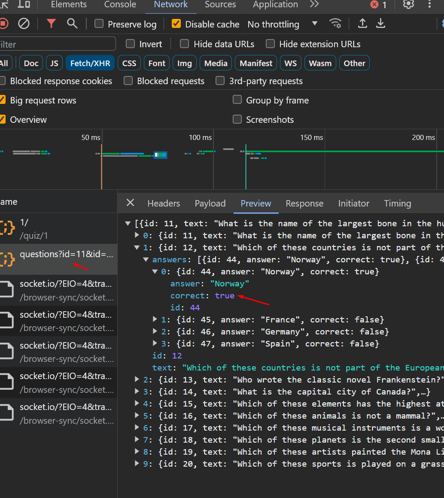

1. Не забывай про gitignore
2. Я несколько раз говорил и в задании написал, что юзер не должен узнать правильный ответ до тех пор пока не ответит на вопрос. Сейчас он может сделать это просто открыв network в девтулзах 
3. Обычно assets называют файлы которые не относятся к исходному коду (фото, видео, шрифты и тп), исходники кладут в директорию src. Посмотри какая у меня структура файлов 
